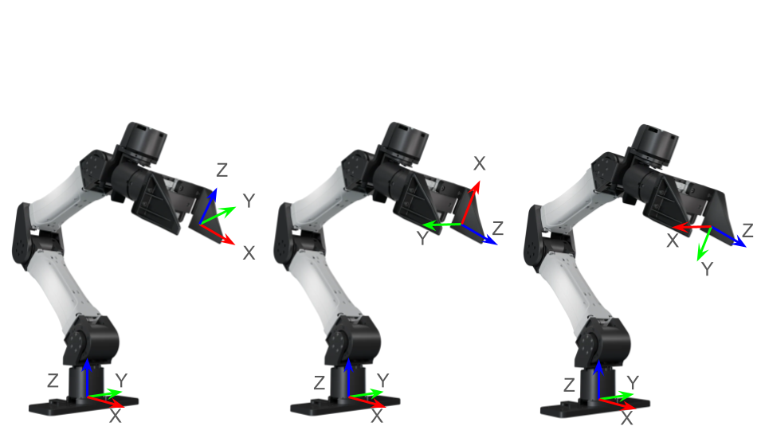

# Instructions

## Setup
```
uv venv --python 3.11
source .venv/bin/activate
uv pip install -r requirements.txt
```

To view a trajectory

```
python visualize_trajectory.py --data-path data/standard/yam/fold_napkin_utensils/episode_57c4fabe/
```

# Library

We provide the `Trajectory` class for convienience. You may access the raw underlying data, but there are many idiosyncrasies in the data formats so we suggest using this client library to load the data.

```python
from trajectory import load_trajectory, ArmSide, CameraPerspective, FrameConvention

# Load trajectory
traj = load_trajectory(Path("data/standard/yam/episode_xyz"))

# Basic properties
traj.n_frames                           # Number of frames in trajectory
traj.annotation_map                     # Dict[int, List[str]] - annotations per frame

# Joint positions (6 or 7 DOF depending on robot, does not exist for XMI)
traj.get_joint_pos_action(ArmSide.LEFT)   # Commanded joint positions
traj.get_joint_pos_obs(ArmSide.RIGHT)     # Observed joint positions

# End-effector poses (4x4 transformation matrices)
traj.get_ee_pose_action(ArmSide.LEFT, FrameConvention.GRIPPER_RDF)   # Commanded EE pose
traj.get_ee_pose_obs(ArmSide.RIGHT, FrameConvention.WORLD_FLU)       # Observed EE pose

# Gripper positions (0=closed, 1=open)
traj.get_gripper_pos_action(ArmSide.LEFT)   # Commanded gripper position
traj.get_gripper_pos_obs(ArmSide.RIGHT)     # Observed gripper position

# Camera data
traj.get_video_path(CameraPerspective.TOP)    # Path to video file
traj.get_video(CameraPerspective.LEFT)        # Video frames as numpy array
```

Most functions should be self-explanatory. Please take a look at `visualize_trajectory.py` to see how we use this class.

When calling `get_ee_pose_action()` or `get_ee_pose_obs()`, you can request the end effector pose in one of the following conventions:



From left to right: FrameConvention.WORLD_FLU, FrameConvention.GRIPPER_URF, FrameConvention.GRIPPER_RDF

GRIPPER_RDF is default.

## Simulation

We provide a sample MuJoCo XML model of the YAM station in the `station_mjcf/` directory. This is useful for development, testing, and visualization.

To launch the MuJoCo viewer with the station:

```
python visualize_stations.py
```

We also include a sample `dm_env`-compatible environment in `station_mjcf/yam_env.py`, which demonstrates how to construct your own simulation tasks using the YAM station. You can run the environment viewer with:

```
cd station_mjcf
python yam_env.py
```

Sample demonstration data from the simulated YAM environment is available upon request.

Note: on Mac you will have to replace `python` with `mjpython`:

```
mjpython visualize_stations.py
mjpython yam_env.py
```

If installing with UV, you may also need to apply a bugfix: [details on github](https://github.com/google-deepmind/mujoco/issues/1923#issuecomment-2752784740)

```
# Find the path to LIBDIR and LDLIBRARY (dylib file) on your system:
PYTHON_LIB_DIR=$(python3 -c 'from distutils.sysconfig import get_config_var; print(get_config_var("LIBDIR"))')
PYTHON_LIB_NAME=$(python3 -c 'from distutils.sysconfig import get_config_var; print(get_config_var("LDLIBRARY"))')
# Soft link it inside your virtual environment:
ln -s "$PYTHON_LIB_DIR/$PYTHON_LIB_NAME" ./.venv/lib/$PYTHON_LIB_NAME
```

# Data Format

This folder contains trajectory data for episodes recorded with multi-modal input, including gripper actions, head and hand pose, camera video, and gripper state feedback.

## File Structure

Each episode is stored in a folder named:

```
<robot_type>/episode_<hash>.npy.mp4/
```

## File Description

These are the raw data files we save. Preferably, you would use the client libraries we provide, or look into them to see how we use them.

Legend:

✅ = Included in this robot configuration

\- = Not part of this robot configuration

💬 = Available on Request

| Filename                                      | Description | Base Robot | Robot with Robotiq Gripper | XMI |
|----------------------------------------------|-------------|-------|-----------|-----|
| `action-{left,right}-pos.npy`  | Array[float] Desired joint angles. Absolute, not delta. **Note:** the desired tool positions are appended at the end. i.e. DOF = DOF of arm + DOF of tool. For XMI, this is just DOF of tool. | ✅ | ✅ | ✅ |
| `action-{left,right}-pose.npy`  | Array[4x4 numpy transformation matrix] representing end-effector poses. i.e. $^WT^{tcp}$ | ✅ | ✅ | - |
| `action-{left,right}-quest_world_frame.npy` | The **controller initialization frame** (6DoF pose) for left/right Quest controllers. i.e. $^WT^{controller_0}$. This is fixed at initialization (i.e. frame[0] == frame[n]). | - | - | ✅ |
| `action-{left,right}-hand_in_quest_world_frame.npy`  | Array[4x4 numpy transformation matrix] The hand's pose in **controller initialization frame**. i.e. $^{controller_0}T^{tcp}$| - | - | ✅ |
| `action-{left,right}-head.npy` | Array[4x4 numpy transformation matrix] The head movement in **Quest world frame**. Left and right are identical. | - | - | ✅ |

## Robot Feedback

| Filename                | Description | Robot | Robot with Robotiq Gripper | XMI |
|------------------------|-------------|-------|-----------|-----|
| `{left,right}-joint_pos.npy`   | Array[float] Joint positions. **NOTE!:**: The position of the end effector is appended at the end. i.e. DOF = DOF of arm + DOF of tool. (likely 7-DOF). | ✅ | ✅ | ✅ |
| `{left,right}-gripper_pos.npy` | `float` Gripper position (if available). 0 is closed, 1 is open. For XMI, this is just in joint_pos.| ✅ | ✅ | - |
| `{left,right}-speed.npy` | `float` Speed setting for gripper | - | ✅ | ✅ |
| `{left,right}-force.npy` | `float` Force setting for gripper. | - | ✅ | ✅ |
| `{left,right}-object_detected.npy` | `bool` Whether or not the gripper has detected an object in its grasp. | - | ✅ | ✅ |

## Timestamps

| Filename         | Description | Unit | Robot | Robot with Robotiq Gripper | XMI |
|------------------|-------------|------|-------|-----------|-----|
| `timestamp.npy`  | Array[float] Start time of each environment loop (used to sync other data). | sec | ✅ | ✅ | ✅ |


## Camera Data

| Filename                        | Description | Robot | Robot with Robotiq Gripper | XMI |
|--------------------------------|-------------|-------|-----------|-----|
| `{top, left, right}_camera-images-rgb.mp4`   | RGB video from top-down and left/right wrist-mounted camera. | ✅ | ✅ | ✅ |
| `{top, left, right}_camera-images-rgb_low_res.mp4`    | Same as above but in lower resolution. | 💬 | 💬 | 💬 |

## Other Files

| Filename                | Description | Robot | Robot with Robotiq Gripper | XMI |
|------------------------|-------------|-------|-----------|-----|
| `metadata.json`        | Episode metadata and configuration information. | ✅ | ✅ | ✅ |
| `top_camera-images-rgb_annotation.json` | JSON annotation file for various of annotations for this trajectory. | 💬 | 💬 | 💬 |

---


### Metadata

The `metadata.json` file describes the task and environment.

Note: `world_frame`, `extrinsics` are not present in very old data. In that case, the `world_frame` is presumed to be `left_arm` and the right extrinisic is presumed to be equal to the example shown below.

The world frame is consistent within an episode but may vary across episodes. A world frame of `left_arm` means the frame is at the center of the base of the left_arm.

Example:
```
{
  "task_name": "Place trousers on hanger",
  "env_loop_frequency": 30,
  "duration": 99.61224031448364,
  "arm_type": "yam",
  "world_frame": "left_arm",
  "extrinsics": {
    "right_arm_extrinsic": {
      "position": [
        0,
        -0.61,
        0
      ],
      "rotation": [
        1,
        0,
        0,
        0
      ]
    }
  }
}
```

---

## Annotations
Each episode contains some language annotations aligned with the robot's environment loop (frame index). The annotations are frame-accurate and describe what the human teleoperator is doing at each step.

### How it works
- The robot data is recorded in discrete environment steps (one frame = one env step).
- Annotations are **segment-based**, each with a `from_frame` and `to_frame` index.
- These indices map directly to the `.mp4`, which allows precise alignment between the annotation and sensor/robot/camera data.
- This makes it easy to slice and visualize segments of interest in synchronized visualizations.

### Annotation Types

There are **three annotation folders**, each representing a different level of granularity:
1. **standard/**
   - Coarse, human-written language descriptions for each high-level step.
   - Captures the intent and motion of the teleoperator (e.g., _"grasp the box with the left hand"_).

2. **detailed/**
   - Denser, step-by-step narration with finer granularity.
   - Useful for tasks that benefit from temporally rich supervision or for training LLMs with aligned language.

### Annotation Format (JSON)
Each annotation is a JSON object like this, which contains (optional) video labels and (optional) timeline segmentation annotations.
```json
{
  "version": "1.0",
  "video_labels": [
    {
      "class_description": "overall_quality",
      "label": "good"
    }
  ],
  "annotations": [
    {
      "id": "mark_66369ff2-f187-4235-9a4f-5d9d3c7fb031",
      "type": "segment",
      "from_frame": 662,
      "to_frame": 768,
      "label": "use the right hand to grasp the black box and put it into the tote"
    },
    ...
  ]
}
```

### Alignment with Other Modalities
All data streams (e.g., robot state, video, actions) are aligned by `frame` index:
- Each frame corresponds to one row in the `.npy` files and one timestamp in `timestamp.npy`.
- This makes it easy to fuse data from multiple modalities or create multimodal training samples.

---

In terms of how to parse the annotations, you can refer to the function `load_per_frame_segment_annotation` in `rerun_vis_traj.py`.

## Example view


You can click this refresh icon on the left column to let rerun automatically generate the visualization based on the data logged.


## Notes
- All `.npy` files contain time-synchronized arrays across the trajectory.
- The world frame is consistent within an episode but may vary across episodes.
- Use `timestamp.npy` to align different data streams.
- Videos are stored using OpenCV-compatible `.mp4` encoding.
